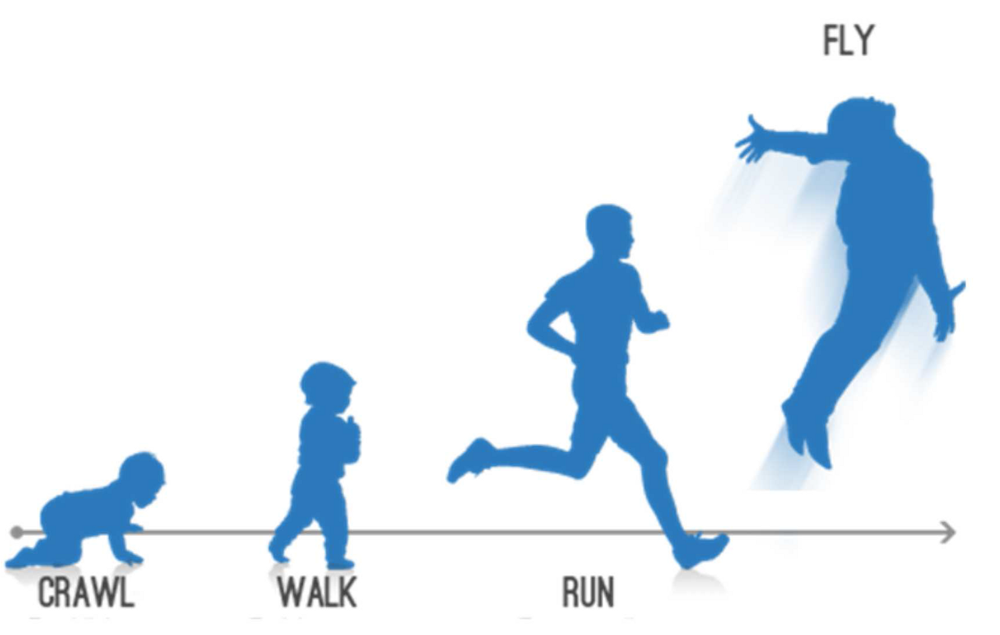
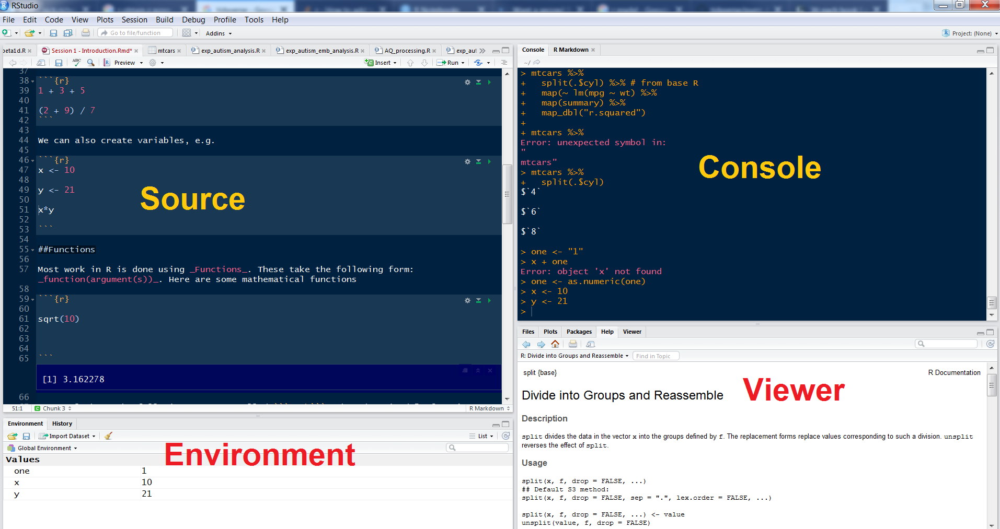
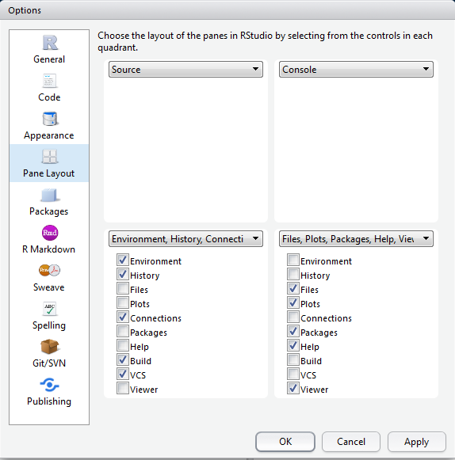
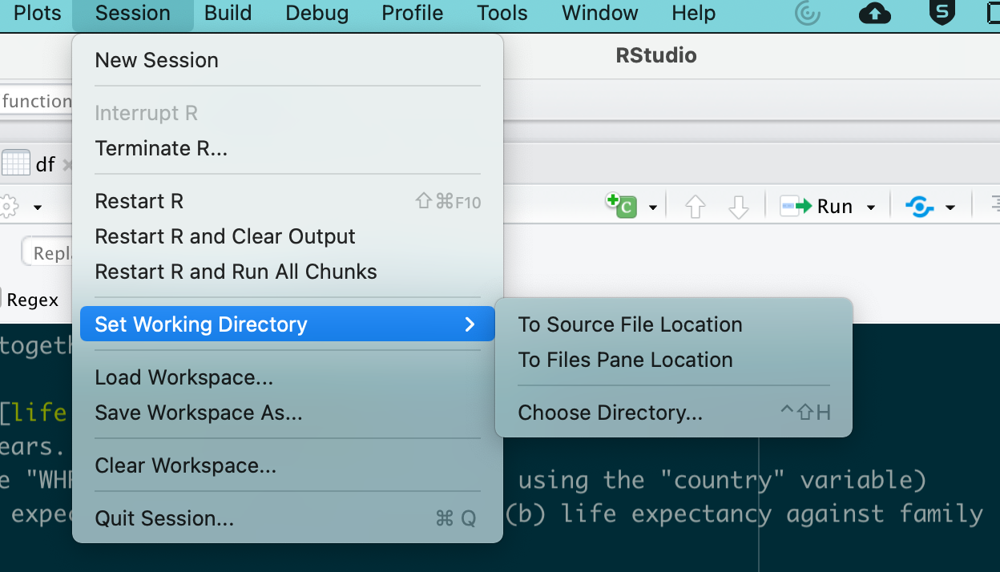
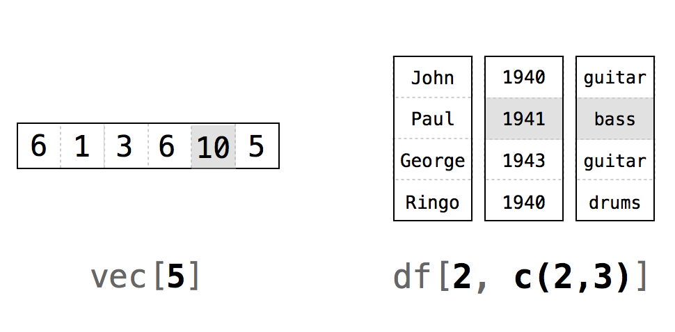

# The purpose of this course

- An introduction to basic techniques in R

- An interdisciplinary approach to R, e.g. regression modelling for psychologists, and text analysis for digital humanities

# Why R?

- *Open Source*
  - means that analyses are (a) cutting edge and (b) accurate
- *Strong emphasis on reproducible research*
  - data are (a) accurately reported (b) shareable

# How to use an R Markdown file

This is an [R Markdown](http://rmarkdown.rstudio.com) Notebook. When you execute code within the notebook, the results appear beneath the code.

Try executing this chunk by clicking the *Run* button within the chunk or by
placing your cursor inside it and pressing *Ctrl+Shift+Enter*.


```{r plot cars}
plot(cars)
```

Add a new chunk by clicking the *Insert* button on the toolbar or by
pressing *Ctrl+Alt+I*.

When you save the notebook, an HTML file containing the code and output will be saved alongside it (click the *Preview* button or press *Ctrl+Shift+K* to
preview the HTML file).


```{r assign value to variable}
one <- 1
one
```


# RStudio breakdown

## Panes

RStudio shows you four panes:

1. The 'Source' pane: the file where you write your code
2. The 'Console' where actual code is run
3. The 'Environment' pane, which shows you variables / datasets
3. The 'Viewer' pane, which shows you plots and help files




You can arrange these in any order using Tools > Global Options.




## Autocomplete

RStudio has fantastic autocomplete capabilites. To autocomplete just press TAB. This is especially useful when loading files as using autocomplete will help you to identify relevant ones. However it also does lots of other things...

# R basics

## Setting the working directory

At the very beginning of an R session you MUST set a 'working directory'. This tells R where to look for and save files. An easy way to do this is from RStudio. We're going to look at three ways to dos this.

### The easy way

Within `RStudio go to Session >> Set Working Directory > Choose Directory...`



You also have an option to set the working directory to the most recently-loaded `.R` or `.Rmd` file.

### The difficult way (1)

To do this type

`setwd("path/to/directory")`

Unfortunately, if you are on a windows machine you will need to change all
backslashes `\` to forward slashes `/`. This is because R follows UNIX conventions which are native to Linux and Mac computers.

If you are not sure what your working directory is type

`getwd()`

Getting the right path is a vital first step in R, and you really need to know how to do this. Here are some instructional videos if you get stuck...

For Windows computers refer to [this YouTube video](https://www.youtube.com/watch?v=QzSV8wvA1Do). For Macs refer to [this YouTube video](https://www.youtube.com/watch?v=43W9TuPwqac). If you're on Linux then refer to [this YouTube video](https://www.youtube.com/watch?v=dQw4w9WgXcQ)

However this is a big problem with this approach. If you send your file to someone else who is working on a different machine, it is most likely that your path will be pointing to the wrong location

### The difficult way (2) (but by far the best way!)

By far the best way to set the working directory is create and "R Project" in RStudio. When you do this, the RProject stores all files and data objects which were opened in the last session, and also keeps track of where the files are stored, so there is no need to set the directory.


## Using R as a calculator

We can use the console for general arithmetic

```{r basic arithmetic}

1 + 3 + 5
(2 + 9) / 7

1 + 2+ 3

```

We can also create variables, e.g.

```{r creating variables}

x <- 10 # This is a comment
x = 10 # Does the same thing!!
y <- 21
x*y

```


## Comments

If you'd like to comment on any code you write (i.e. you do not wish R to try to 'run' this code) just add a hash (`#`) or series of hashes in front of it, e.g.

```{r Commenting example}

x <- 100 # create a variable called x with the valuee 100

# Now double it

x*2

```


## Functions

Most work in R is done using _Functions_. These take the following form:
_function(argument(s))_. Here are some functions

```{r some base R functions}

sqrt(10)

seq(1, 10, 2)

rep(5, 10)

```


## EX 1 & 2: Working with Functions

EX1: What do the arguments of `seq` and `rep` do? To find out more search for the relevant help file in the console by typing `?seq` or by using Google.

EX2: Have a look at the following arguments called `gsub` and `grepl`. What do they do? Clue: if you're stuck, search the help file using `?`

```{r some functions}

gsub("R-studio", "Rstudio", "R-studio is a great piece of software")

grepl("chocolate", "Mary likes chocolate cookies")

```


## DIY functions

It's possible to **create your own functions**. This makes R extremely powerful and extendable. We're not going to cover making your own functions in this course, but it's important to be aware of this capability. There are plenty of good resources online for learning how to do this, including [this one](https://www.statmethods.net/management/userfunctions.html)

## Getting help

As we have seen above, to find out about a particular function just type `?` and the name of the function into the console, e.g. `?grepl`. This accesses the help files on your computer. If you'd like to search more broadly type `??grepl` and your computer will look online for relevant materials on CRAN (the main R website)

Help files in R are quite densely written and not particularly aimed at beginners. Fortunately there are loads of excellent resources on the internet. Here are some really good sites:

(a) [https://www.tidyverse.org/](https://www.tidyverse.org/) - A brilliant set of of resources on all things related to the tidyverse, Hadley Wickham's brilliant suite of packages
(b) [https://www.statmethods.net/index.html](https://www.statmethods.net/index.html) - a quick way of looking up basic R techniques
(c) [https://stats.idre.ucla.edu/r/modules/](https://stats.idre.ucla.edu/r/modules/)
(d) [https://rseek.org/](https://rseek.org/) - a search engine for all things related to R (because the word 'R' brings up a whole load of irrelevant stuff in Google)
(e) [http://www.cookbook-r.com/](http://www.cookbook-r.com/) - this has lots of tips on how to do graphics.

And there are plenty more! If you find a good one share it with your colleagues via email, Twitter, or whatever social media you prefer!


# Packages

## Installation

To enhance the basic capabilities of R, we need to load packages/libraries. Most of the
time, we download these from 'CRAN' `Tools > Install packages` or `install.packages()`. Once the package/library is installed (i.e. it is sitting somewhere on your computer), we then need to _load_ it to the current R session using the `library()` function.

Remember using a package/library is a two-stage process. We

1. *Install* the package/library onto your computer (from the internet)
2. *Load* the package/library into your current session using the `library` command.

One of the most useful packages is called 'tidyverse'.


It contains a number of useful commands for plots, and data manipulation.

Install the 'tidyverse' package, and then load it with the following function:

```{r loading a package using the "library" command}
library(tidyverse)
```


I find that a particularly easy way to load packages is via the `p_load` function from the `pacman` library. We are not going to practise using it, but just to let you know that it exists!

## Obtaining help

To find out more about a package type `?package_name` in the console. Alternatively you can look for the package documentation on [CRAN](https://cran.r-project.org/).

## Using functions from packages

Most of the functions loaded in a package should work 'out of the box'. However occasionally you need to refer to the package first, and then the function using the format `package_name::function_from_that_package`. This is useful for a variety of reasons:

1. It allows you to use a function from a package without having to load that package (using the "library" commmand)
2. It helps in cases where you load two packages which contain two different functions which happen to have the same name.
3. Sometimes, even when a package is loaded, you need to precede a function by the package name. However, most of the time this is not necessary. (NB I am not sure why R sometimes requires the name of the package to be specified like this)

## EX 3 - Using packages

1. Install and load the package `ggplot2`
2. Look up the function `geom_point` from this package. What does it do?

# Objects, data frames and indices

## Objects

A variable is a type of 'object' which R stores in memory. R is capable of creating and storing a wide range of objects. To see what type of object we have created, we use the function `class()`, e.g.

```{r using the class function to determine the type of object}

x <- 1

class(x)

z <- "hello"

class(z)

```


*class* is one of the most useful functions in R as errors are often due to misassignment of class, e.g.

```{r deliberately throwing an error, error = TRUE}

x + z

```

Here we have tried to add a number to a string which is clearly impossible. It's possible to change the class of an object using commands such as
`as.character`, `as.integer`, `as.numeric`, `as.factor`, e.g.

```{r coercing a variable frome one type to another, error = TRUE}
one <- "1"
x + one
one <- as.numeric(one)
x + one 
```

Here is a visual summary of *some* of the main data types / object classes in R:


Here are some definitions

(1) *integer* = rounded number
(2) *numeric* = number with decimal points
(3) *character* = a string of characters
(4) *logical* = has a TRUE / FALSE value
(5) *factor* = a label which looks like a character variable, but which is mapped to a nominal variable, e.g. "nationality"
(6) *vector* = a one-dimensional array where each position contains a different value from the same data type, e.g. a series of numbers, or a series of words.
(7) *list* = a one-dimensional array where ach position contains a different value. Data types may _vary_
(8) *matrix* = a two-dimensional array where all values are from the same data type
(9) *data frame* = a typical "spreadsheet" format. Columns are labelled. Columns may be of different types, e.g. a column containing strings (characters), or a column containing numbers.


In order to create a vector we need to use the `c` function. (c = 'combine'), e.g.

```{r creating vectors}

vector.of.numbers <- c(1,4,54,22,43,9,0,0,21)

mean(vector.of.numbers)

sd(vector.of.numbers)
```
```{r create character vector and a list}

a.character.vector <- c("Mary", "Jane", "Ali", "Chen")

a.list <- as.list(c(1, 2, "Mary", "Jane"))

```


## Creating a data frame from scratch

A data frame is a two-dimensional object containing variables and row numbers. It's basically a spreadsheet.

The following code creates a data frame programmatically. It creates two variables, and combines them together to make a data frame. Note that to do this we need to use the functions `as.data.frame` and `cbind`.

```{r Creating a dataframe from scratch}
list.of.movies <- c("Independence Day", "Pretty Woman", "The Godfather Part
Two", "Planet of the Apes (original)")

rotten.tomatoes.variable <- c(62, 61, 97, 89)

df <- as.data.frame(cbind(list.of.movies, rotten.tomatoes.variable)) # 'cbind' binds columns together
```

## Viewing the contents of a data frame

To glimpse the top few rows type `head(name_of_data_frame)` in the console, e.g.

```{r viewing the top few rows using head}
head(df)
```

To view the data frame in the 'source' window, type `View(name_of_data_frame)` in the console, .e.g.

```{r viewing a df in the built-in viewer}
View(df) #NB first letter is a capital letter.
```


## Referring to variables

To refer to variables, use the following syntax `data_frame_name$variable_name`, e.g.

```{r Referring to variables}
df$list.of.movies
```

When naming variables we can use dots and underscores, e.g. `df$list.of.movies` and `df$list_of_movies`. We can use numbers as long as they don't come at the beginning, e.g. `df$list_of_movies.v3`.

If you use this convention, then the names for variables can get very long. However, it's generally useful, as in R you often have multiple data frames loaded into memory. By specifiying both the name of the data frame and the variable, this avoids confusion.

Try to be consistent with your naming conventions. I tend to use underscores to name variables, e.g. `data.frame.x$variable_y`. This is also what Hadley Wickham recommends (Have a look at the [Tidyverse Style Guide](https://style.tidyverse.org/))

If you'd like to see all the variable names in a data frame type `names(data_frame)`, e.g. 

```{r listing variable names}
names(df)
```


## Indices

Whenever you wish to access the contents of an object with multiple values (e.g. a data frame) you use indexes. These are placed inside square brackets, e.g. `[1]`. Have a look at the following example:


```{r intro to indices}
df[1,2]

df[1,] # here the second number is blank

df[,2] # here the first number is blank
```

Below is a diagram demonstrating how indices work.



## EX 3 - understanding indices

What does each number refer to? What happens when we leave a blank cell?

## Reading data frames from files using menus

We can use the menu in Rstudio: `File > Import dataset`. You can do this to import Excel, SPSS, SAS and STATA files.


## Reading data frames from files using code

However, rather than use the menu, it's much better to use actual code, as this will automate the process. Let's import a dataset on World Happiness Report (2017), by country. The files are [WHR_2019.xlsx](WHR_2019.xlsx), and [WHR_2019.csv](WHR_2019.csv). Alternatively you can actually download the data set straight from the URL (below)


```{r reading in data, message = FALSE}

library(tidyverse)

df <- readxl::read_excel("WHR_2019.xlsx") # Read an excel file

df <- read_csv("WHR_2019.csv") # Read from a .csv file

# Or to download straight from the URL!!

# df <- read_csv("https://verbingnouns.github.io/AdventuresInR/docs/WHR_2017.csv")

# This code adds a region variable for each country. Don't worry about how the code works. We will come back go it later!!

df.regions <- readxl::read_excel("countries_and_regions.xlsx")

df %>% merge(df.regions) -> df

```


Possibly the best data format to work in is the .csv data format (Comma-Separated Value). This is good because it is readable in Excel, small, simple, and not easily-corrupted.

To read .csv files we use the `read.csv()` function from base R, or `read_csv()` from the tidyverse (I would go with the latter as it also shows you a list of the variable types)


# Subsetting a data set using (a) base R and (d) dplyr

## Subsetting with base R

We're going to *subset* the WHR dataset (i.e. choose only those cases/observations which fulfil a specific criterion). To do this we're going to use the `which()` function. When you apply `which` to a variable in a dataset, it will produce indices (indexes) of the rows which fulfil a certain criterio, e.g. `which(df$var_name == 2)` will give you the indices of all rows where the value of the variable is 2.

## EX4: Subsetting the hard way!

Armed with this knowledge, your task is to subset the data frame so that it only contains information from African countries.

If you're stuck have a look at the answer below. 

```{r Subsetting the hard way}
df.Africa <- df[which(df$region == "Africa"), ]
```

## Piping

Okay, the above code is pretty horrible to look at, so we're going to explore an alternative using the package `dplyr` which is from the `tidyverse`. But before we can use `dplyr` we have to learn how to 'pipe'.


Pipes are written in R as `%>%` (note you must use a percentage sign before and after the pipe). To demonstrate what pipes do, I have a look at the following pseudocode.


All pipes do is enable us to 'pass' a data frame (or another object) to a new function without having to keep on specifying the data frame. In addition, we can *chain* pipes together indefinitely.

Here's how we would subset the data frame using piping:

```{r subsetting using a pipe}

df.Africa <- filter(df, region == "Africa") # This is the version without piping

df %>% filter(region == "Africa") -> df.Africa # This is the version with piping. It looks longer, but we can chain multiple functions together!
```

Note that to create a new data frame, we need a solid arrow at the end. If we don't include that solid arrow, the results are shown in the console, but no new data frame is created. This is an incredibly useful feature of pipes. You can `try before you buy`!

And here is an example where we *chain* a series of pipes together:

```{r chaining a series of pipes}

df.new <- read_csv("WHR_2019.csv")

df.new %>% 
  merge(df.regions) %>% 
  group_by(region) %>%
  summarise(mean.happiness = mean(happiness_score)) ->
  df.mean.happiness.by.region

```

NB When piping the code becomes more readable when the line ends with the pipe.

There are a couple of important points to note.

(1) We can refer to variables without specifying the data frame
(2) If we wish to store the results we must output them using and arrow `->`. If we don't store the results they will merely be displayed in the console.

Piping is a key technique in R and once you've learnt it you will write much more powerful and readable code.

As well as using pipes to create data frame, you can also insert pipes into both analyses and figures! Here are some examples

```{r using pipes inside statistical models and plots}

# An ANOVA without a pipe. NB we are using the base function "aov". If you would like to conduct SPSS-style ANOVAs, the best package is called "afex".


mod <- aov(rank ~ region, data = df)

pacman::p_load(broom) # To load the "tidy" function.

tidy(mod)

# Here we use a pipe inside the analysis
mod <- aov(rank ~ region, # NB note we can break the line after a comma
           data = df %>% filter(region == "Africa" | region == "South America"))

tidy(mod)


g <- ggplot(aes(x = gdp_per_capita, y = happiness_score, colour = region), # NB note we can break the line after a comma
            data = df %>% filter(region == "Africa" | region == "South America"))
g <- g + geom_point()
g <- g + geom_smooth(method = "lm")
g


```

Note how I have broken some of the lines after a comma. This makes the code more readable. Generally we can break a line when it ends in some kind of symbol, e.g. a pipe, an arrow, or a comma.


# Loops and if-then statements

Loops and if-then statements are useful programming tools which have the same structure: `FUNCTION (STATEMENT) {.....}`.

## Loops


```{r a basic loop}
for(i in 1:10){
  print(as.character(i))
}
```


To demonstrate a loop we're going to look at the WHR data set. We're going to ask the question 'for different regions of the world, what is the relationship between GDP per capita nd happiness?

Here's how we would do it

```{r looping through countries}

# This code drops regions where number of observations are less than 3 (we can't do correlations if there are less than 3 observations)

df %>%
  group_by(region) %>%
  summarise(num = n()) %>%
  filter(num > 3) ->
  df.region

# Here is the code with the loop

for (i in 1:length(df.region$region)){ # We loop through the list
  df %>% filter(region == df.region$region[i]) -> temp.df # we subset the data according to the region. This contains a temporary dataset "temp.df"
  model <- cor.test(temp.df$gdp_per_capita, temp.df$happiness_score) # We do the analysis
  print(paste("Region: ", df.region$region[i])) # We print the results
  print(model)
}

```

## EX5: Loops

The code below creates a sequence ranging from 0 to 30 going up in steps of 0.25. Try to achieve the same result using a loop

```{r exercise on loops}
seq(0,30,2.5)
```


## If-then statements

To demonstrate if-then statements, we are going to create a new variable which shows if the happiness index is above the mean

```{r an if-then statement inside a loop}
df$happiness_above_mean <- 0 # Set variable to 0
mean_happiness <- mean(df$happiness_score) # Calculate mean mpg
for (i in 1:nrow(df)){
  if(df$happiness_score[i] > mean_happiness){df$happiness_above_mean[i] <- 1}
}
```


Note loops and if-then statements are quite verbose, and there is almost always a neater and much shorter alternatives. However, I think they are useful procedures for the relative beginner.

Here is some code using `dplyr`, which does the same thing, but avoids the loop and the if-then statement.

```{r an easier way to do this using dplyr}

df %>%
  mutate(happiness_above_mean = as.numeric(happiness_score > mean(happiness_score)))
```

So how does this work? The statement in brackets evaluates to TRUE / FALSE. We then turn this into a number using `as.numeric`. TRUE evaluates to 1, while FALSE evaluates to 0.

It can be quite useful to combine logical statements. For example, if we wish to identify countries where both the happiness score and life expectancy are above the mean, we could do this....

```{r combining logical statements}
df$happiness_and_LE_above_mean <- as.numeric(
  (df$happiness_score > mean(df$happiness_score)) &
  (df$healthy_life_expectancy > mean(df$healthy_life_expectancy))
  )
```

## EX6: Creating variables

Try to identify countries where both the GDP per capita and trust in the government are above the mean.

# Stored results

Whenever you run an analysis in R and save that to an object, the object has an internal structure. To demonstrate this, let's do a simple regression using the mtcars dataset:

Let's draw a plot looking at the relationship between GDP per capita and Happiness Score. We're not going to focus on the code, which will be covered in the next session.

```{r plot: happiness against GDP}
g <- ggplot(aes(x = df$gdp_per_capita, y = df$happiness_score), data = df)
g <- g + geom_point()
g <- g + geom_smooth()
g
```

Now let's run a regression

```{r running a basic regression}

mod <- lm(happiness_score ~ gdp_per_capita, data = df) # mod = "model"

library(broom) # Broom is a package which produces neat tables of results

tidy(mod) # This is a broom function which tidies up the statistical results for reporting

```


Now, let's have a look at the `structure` of this model. There are two ways to do this:

1. Use the `str` function, e.g. `str(mod)`

```{r viewing the structure of a model}
str(mod)
```

2. Type `mod$`, and then use autocomplete.

We can see that the `$` symbol has a dual function in R: firstly, to specify variables within dataframes, and secondly to specify subcomponents of an object.

It is useful to be able to refer to subcomponents of an object so that we can integrate into our report, e.g. the regression yielded a value of `r summary(mod)$r.squared`

## EX 6: Let's put it all together!!!

(1) Download the data for [life expectancy by country](WHO_life_expectancy.csv)
(2) The data covers many years. Select the most recent year.
(3) Merge the data with the "WHR" data (you will need to merge using the "country" variable)
(4) Draw plots of (a) life expectancy against GDP per capita, (b) life expectancy against family values

Once you get stuck have a look at the first code chunk below. This contains the solution but with pesky errors added! See if you can sort out the errors.

```{r with errors, eval = FALSE, message = FALSE, error=TRUE}

whr <- read_csv("WHR_2019.csv")

le <- read_csv("WHO_life_expectancy.csv")

whr %>% # NB we need to ensure that the "country" variable has exactly the same name in both datasets
  rename(country = Country) ->
  whr

le %>% 
  filter(Year == 2015) %>% 
  merge(whr) %>% 
  df

plot(df$`Life expectancy`, df$GDP)
plot(df$`Life expectancy`, df$family)


```

The code in this chunk shows the solution!

```{r Correct!, message = FALSE}

whr <- read_csv("WHR_2019.csv")

le <- read_csv("WHO_life_expectancy.csv")

whr %>% 
  rename(Country = country) ->
  whr

le %>% 
  filter(Year == 2015) %>% 
  merge(whr) ->
  df

plot(df$`Life expectancy`, df$GDP)
plot(df$`Life expectancy`, df$family)


```


